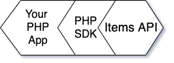
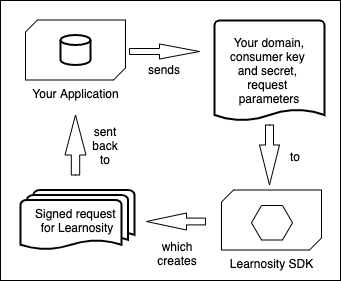
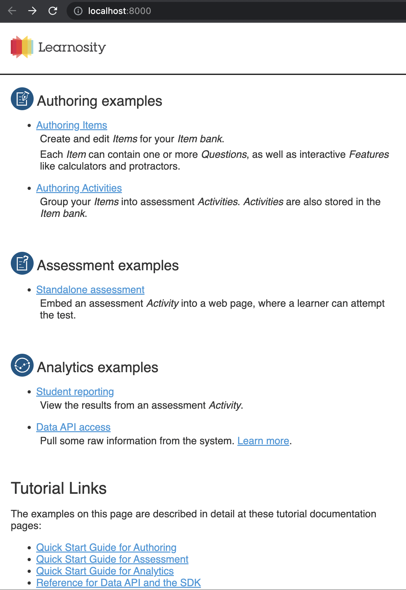
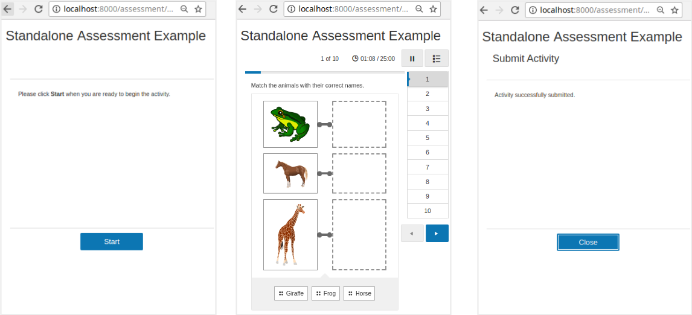

<p align="center"></p>
<h1 align="center">Learnosity SDK - PHP</h1>
<p align="center">Everything you need to start building your app in Learnosity, with the PHP programming language.<br> 
(Prefer another language? <a href="https://help.learnosity.com/hc/en-us/sections/360000194318-Server-side-development-SDKs">Click here</a>)<br>
An official Learnosity open-source project.</p>

[](https://packagist.org/packages/learnosity/learnosity-sdk-php)
[](https://app.travis-ci.com/Learnosity/learnosity-sdk-php)
[](https://packagist.org/packages/learnosity/learnosity-sdk-php)
[](https://packagist.org/packages/learnosity/learnosity-sdk-php) 
[](https://packagist.org/packages/learnosity/learnosity-sdk-php)
---

## Table of Contents

* [Overview: what does it do?](#overview-what-does-it-do)
* [Requirements](#requirements)
* [Installation](#installation)
* [Quick start guide](#quick-start-guide)
* [Next steps: additional documentation](#next-steps-additional-documentation)
* [Contributing to this project](#contributing-to-this-project)
* [License](#license)
* [Usage tracking](#usage-tracking)
* [Further reading](#further-reading)

## Overview: what does it do?
The Learnosity PHP SDK makes it simple to interact with Learnosity APIs.



It provides a number of convenience features for developers, that make it simple to do the following essential tasks:
* Creating signed security requests for API initialization, and
* Interacting with the Data API.

For example, the SDK helps with creating a signed request for Learnosity:



Once the SDK has created the signed request for you, your app sends that on to an API in the Learnosity cloud, which then retrieves the assessment you are asking for, as seen in the diagram below:


This scenario is what you can see running in the Quick start guide example ([see below](#quick-start-guide)).

There's more features, besides. See the detailed list of SDK features on the [reference page](REFERENCE.md).

[(Back to top)](#table-of-contents)

## Requirements
1. Runtime libraries for PHP 8 installed. ([instructions](https://help.learnosity.com/hc/en-us/articles/360000757757-Environment-Setup-Guide))

2. The [Composer](https://getcomposer.org/) package manager installed OR the self-contained ZIP from [GitHub Releases](https://github.com/Learnosity/learnosity-sdk-php/releases/)

Not using PHP? See the [SDKs for other languages](https://help.learnosity.com/hc/en-us/sections/360000194318-Server-side-development-SDKs).

[(Back to top)](#table-of-contents)

## Installation
###  **Installation via Composer**
Using Composer is the recommended way to install the Learnosity SDK for PHP in production. The easiest way is to run this from your parent project folder:

    composer require learnosity/learnosity-sdk-php "^1.0"

You can also specify the requirement manually by adding "learnosity/learnosity-sdk-php" as a dependency in your project's composer.json file.

    {
        "require": {
            "learnosity/learnosity-sdk-php": "^1.0"
        }
    }

Then, install the new dependency with

    composer update learnosity/learnosity-sdk-php

### **Alternative method 1: download the zip file**
Download the latest version of the SDK as a self-contained ZIP file from the [GitHub Releases](https://github.com/Learnosity/learnosity-sdk-php/releases) page. The distribution ZIP file contains all the necessary dependencies. 

You may then include the SDK bootstrap file in your project, for example if the SDK is unzipped to `/srv/learnosity-sdk-php` then you could specify the following in your project to include the SDK:

``` php
<?php
    require_once "/srv/learnosity-sdk-php/bootstrap.php"
```

### **Alternative 2: development install from a git clone**
To install from the terminal, run this command:

    git clone git@github.com:Learnosity/learnosity-sdk-php.git

Note: after installation, run this command in the `learnosity-sdk-php` folder:

    composer install

Note that these manual installation methods are for development and testing only.
For production use, you should install the SDK using the Composer package manager for PHP, as described above.

[(Back to top)](#table-of-contents)

## Quick start guide
Let's take a look at a simple example of the SDK in action. In this example, we'll load an assessment into the browser.

### Running the Quickstart Application

### **Option 1: Running with Docker (Recommended)**
To run the quickstart application using Docker, ensure you have Docker and Docker Compose installed on your system. Then follow these steps:

1. Clone the repository (if you haven't already):
   
   ```bash
   git clone https://github.com/Learnosity/learnosity-sdk-php.git
   cd learnosity-sdk-php
   ```

2. Start the Docker containers:
   
   ```bash
   make quickstart
   ```

### **Option 2: Running Locally**
If you prefer to run the application locally without Docker, follow these prerequisites:

1. Clone the repository (if you haven't already):
   
   ```bash
   git clone https://github.com/Learnosity/learnosity-sdk-php.git
   cd learnosity-sdk-php
   ```

2. Ensure you have PHP 8.x installed
3. Install Composer (https://getcomposer.org/download/)

4. Start the built-in PHP development server:
  
   ```bash
   make quickstart
   ```

**Note:** Local setup requires PHP 8 runtime libraries and may have additional system dependencies. The Docker method provides a more consistent and isolated environment.

(For more information about the web server configuration, [click here](https://help.learnosity.com/hc/en-us/articles/360000757757-Environment-Setup-Guide))

You can now access the APIs using the following URL [click here](http://localhost:8000).



### **View the standalone assessment example**

Now view the standalone assessment example by visiting this address in your browser: http://localhost:8000/assessment/standalone-assessment.php <br>
(or select the "Standalone assessment" example from the [index.html](http://localhost:8000/index.html) page).

This is a basic example of an assessment loaded into a web page with Learnosity's assessment player. You can interact with this demo assessment to try out the various Question types.



[(Back to top)](#table-of-contents)

### **How it works**
Let's walk through the code for this standalone assessment example. The source file is included under the quickstart folder, in this location:

    .../learnosity-sdk-php/docs/quickstart/assessment/standalone-assessment.php

The first section of code is PHP and is executed server-side. It constructs a set of configuration options for Items API, and securely signs them using the consumer key. The second section is HTML and JavaScript and is executed client-side, once the page is loaded in the browser. It renders and runs the assessment functionality.

[(Back to top)](#table-of-contents)

### **Server-side code**
We start by including some LearnositySDK helpers - they'll make it easy to generate and sign the config options, and unique user and session IDs.

``` php
<?php
    require_once __DIR__ . '/../../../../bootstrap.php';
    use LearnositySdk\Request\Init;
    use LearnositySdk\Utils\Uuid;
    $user_id = Uuid::generate();
    $session_id = Uuid::generate();
```

Now we'll declare the configuration options for Items API. These specify which assessment content should be rendered, how it should be displayed, which user is taking this assessment and how their responses should be stored. 

``` php
    $request = [
        'user_id'        => $user_id,
        'activity_template_id' => 'quickstart_examples_activity_template_001',
        'session_id'     => $session_id,
        'activity_id'    => 'quickstart_examples_activity_001'
        'rendering_type' => 'assess',
        'type'           => 'submit_practice',
        'name'           => 'Items API Quickstart',
    ];
```

* `user_id`: unique student identifier. Note: we never send or save student's names or other personally identifiable information in these requests. The unique identifier should be used to look up the entry in a database of students accessible within your system only. [Learn more](https://help.learnosity.com/hc/en-us/articles/360002309578-Student-Privacy-and-Personally-Identifiable-Information-PII-).
* `activity_template_id`: reference of the Activity to retrieve from the Item bank. The Activity defines which Items will be served in this assessment.
* `session_id`: uniquely identifies this specific assessment attempt for save/resume, data retrieval and reporting purposes. Here, we're using the `Uuid` helper to auto-generate a unique session id.
* `activity_id`: a string you define, used solely for analytics to allow you run reporting and compare results of users submitting the same assessment.
* `rendering_type`: selects a rendering mode, `assess` mode is a "standalone" mode (loading a complete assessment player for navigation, as opposed to `inline` for embedding without).
* `type`: selects the context for the student response storage. `submit_practice` mode means the student responses will be stored in the Learnosity cloud, allowing for grading and review.
* `name`: human-friendly display name to be shown in reporting, via Reports API and Data API.

**Note**: you can submit the configuration options either as a PHP array as shown above, or a JSON string.

Next, we declare the Learnosity consumer credentials we'll use to authorize this request. The consumer key and consumer secret in this example are for Learnosity's public "demos" account. Once Learnosity provides your own consumer credentials, your Item bank and assessment data will be tied to your own consumer key and secret. 

``` php
    $consumerKey = 'yis0TYCu7U9V4o7M';
    $consumerSecret = '74c5fd430cf1242a527f6223aebd42d30464be22';
```

<i>(of course, you should never normally check passwords into version control)</i>

Here, we construct security settings that ensure the report is initialized on the intended domain. The value provided to the domain property must match the domain from which the file is actually served.

``` php
    $security = [
        'domain'       => $_SERVER['SERVER_NAME'],
        'consumer_key' => $consumerKey
    ];
```

Now we call LearnositySDK's `Init()` helper to construct our Items API configuration parameters, and sign them securely with the `$security` and `$consumerSecret` parameters. `$init->generate()` returns us a JSON blob of signed configuration parameters.

``` php
    $init = new Init(
        'items',
        $security,
        $consumerSecret,
        $request);
    $initOptions = $init->generate();
?>
```

[(Back to top)](#table-of-contents)

### **Web page content**
We've got our set of signed configuration parameters, so now we can set up our page content for output. The page can be as simple or as complex as needed, using your own HTML, JavaScript and your frameworks of choice to render the desired product experience.

This example uses plain HTML in a PHP page for simplicity. The following example HTML can be found at the bottom of the `standalone-assessment.php` file.

``` html
<!DOCTYPE html>
<html>
    <head><link rel="stylesheet" type="text/css" href="../css/style.css"></head>
    <body>
        <h1>Standalone Assessment Example</h1>
        <div id="learnosity_assess"></div>
        <script src="https://items.learnosity.com/?latest-lts"></script>
        <script>
            var itemsApp = LearnosityItems.init(
                <?php echo $initOptions; ?>
            );
        </script>
    </body>
</html>
```

The important parts to be aware of in this HTML are:

* A div with `id="learnosity_assess"`. This is where the Learnosity assessment player will be rendered to deliver the assessment.
* The `<script src="https://items.learnosity.com/?latest-lts"></script>` tag, which includes Learnosity's Items API on the page and makes the global `LearnosityItems` object available.  The version specified as `latest-lts` will retrieve the latest version supported. To know more about switching to specific LTS version visit [Long Term Support (LTS) version](https://help.learnosity.com/hc/en-us/articles/360001268538-Release-Cadence-and-Version-Lifecycle). In production, you should always pin to a specific LTS version to ensure version compatibility.
* The call to `LearnosityItems.init()`, which initiates Items API to inject the assessment player into the page.
* `PHP echo` dynamically sends the contents of our signed JSON blob of $initOptions to JavaScript, so it can be passed to `init()`.

The call to `init()` returns an instance of the ItemsApp, which we can use to programmatically drive the assessment using its methods.

This marks the end of the quick start guide. From here, try modifying the example files yourself, you are welcome to use this code as a basis for your own projects.

Take a look at some more in-depth options and tutorials on using Learnosity assessment functionality below.

[(Back to top)](#table-of-contents)

## Next steps: additional documentation

### **SDK reference**
See a more detailed breakdown of all the SDK features, and examples of how to use more advanced or specialised features on the [SDK reference page](REFERENCE.md).

### **Additional quick start guides**
There are more quick start guides, going beyond the initial quick start topic of loading an assessment, these further tutorials show how to set up authoring and analytics:
* [Authoring Items quick start guide](https://help.learnosity.com/hc/en-us/articles/360000754958-Getting-Started-With-the-Author-API) (Author API) - create and edit new Questions and Items for your Item bank, then group your assessment Items into Activities, and
* [Analytics / student reporting quick start guide](https://help.learnosity.com/hc/en-us/articles/360000755838-Getting-Started-With-the-Reports-API) (Reports API) - view the results and scores from an assessment Activity. 

### **Learnosity demos repository**
On our [demo site](https://demos.learnosity.com/), browse through many examples of Learnosity API integration. You can also download the entire demo site source code, the code for any single demo, or browse the codebase directly on GitHub.

### **Learnosity developer documentation**
See full documentation for Learnosity API init options, methods and events in the [Learnosity developer documentation](https://help.learnosity.com/hc/en-us/categories/16266193425053).

### **Technical use-cases documentation**
Find guidance on how to select a development pattern and arrange the architecture of your application with Learnosity, in the [Technical Use-Cases Overview](https://help.learnosity.com/hc/en-us/articles/360000757777-Technical-Use-Cases-Overview).

### **Deciding what to build or integrate**
Get help deciding what application functionality to build yourself, or integrate off-the-shelf with the [Learnosity "Golden Path" documentation](https://help.learnosity.com/hc/en-us/articles/360000754578-Recommended-Deployment-Patterns-Golden-Path-).

### **Key Learnosity concepts**
Want more general information about how apps on Learnosity actually work? Take a look at our [Key Learnosity Concepts page](https://help.learnosity.com/hc/en-us/articles/360000754638-Key-Learnosity-Concepts).

### **Glossary**
Need an explanation for the unique Learnosity meanings for Item, Activity and Item bank? See our [Glossary of Learnosity-specific terms](https://help.learnosity.com/hc/en-us/articles/360000754838-Glossary-of-Learnosity-and-Industry-Terms).

[(Back to top)](#table-of-contents)

## Contributing to this project

### Adding new features or fixing bugs
Contributions are welcome. See the [contributing instructions](CONTRIBUTING.md) page for more information. You can also get in touch via our support team.

[(Back to top)](#table-of-contents)

## License
The Learnosity PHP SDK is licensed under an Apache 2.0 license. [Read more](LICENSE.md).

[(Back to top)](#table-of-contents)

## Usage tracking
Our SDKs include code to track the following information by adding it to the request being signed:
- SDK version
- SDK language
- SDK language version
- Host platform (OS)
- Platform version

We use this data to enable better support and feature planning.

[(Back to top)](#table-of-contents)

## Further reading
Thanks for reading to the end! Find more information about developing an app with Learnosity on our documentation sites: 

* [help.learnosity.com](http://help.learnosity.com/hc/en-us) -- general help portal, tutorials, and developer reference.
* [authorguide.learnosity.com](http://authorguide.learnosity.com) -- authoring documentation for content creators.

[(Back to top)](#table-of-contents)
